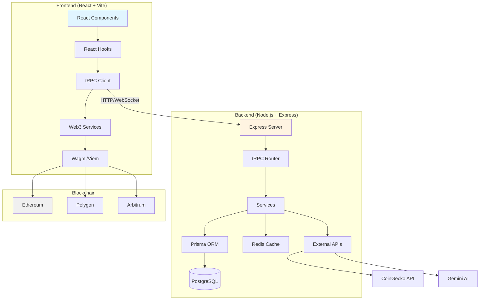
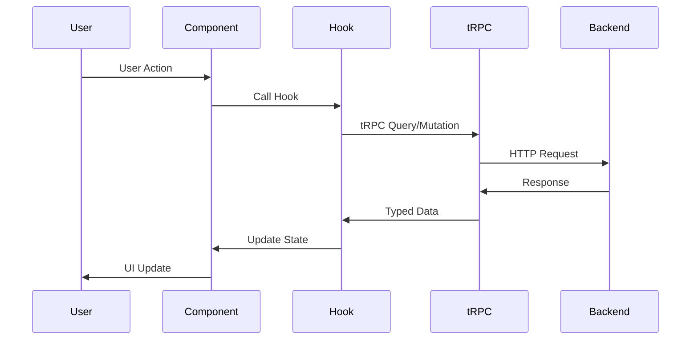
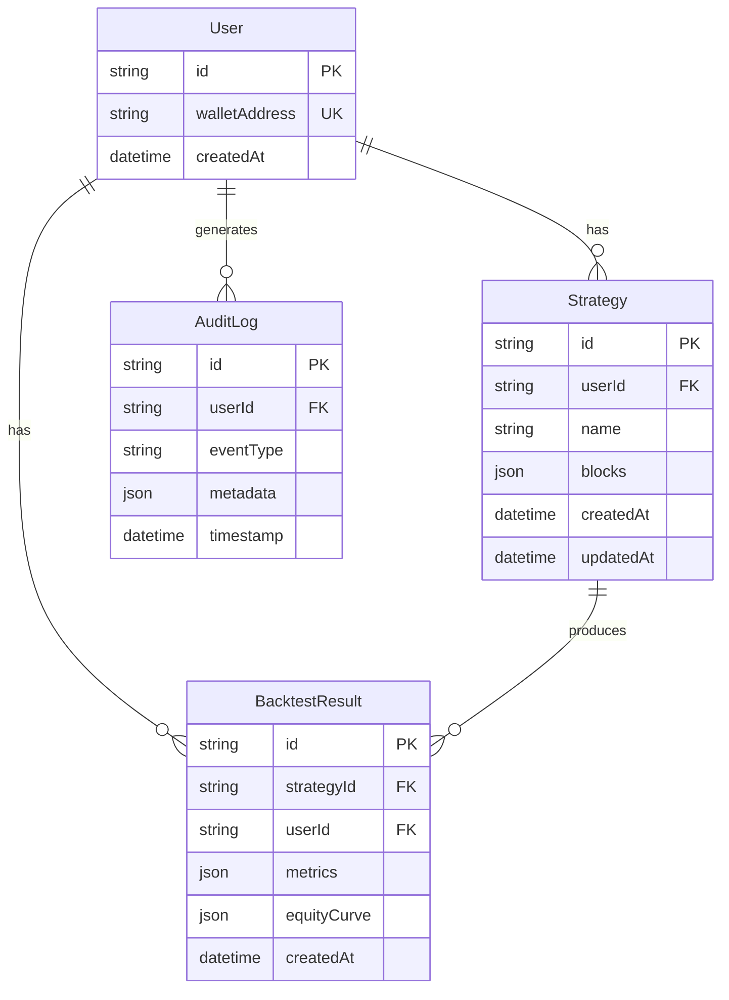
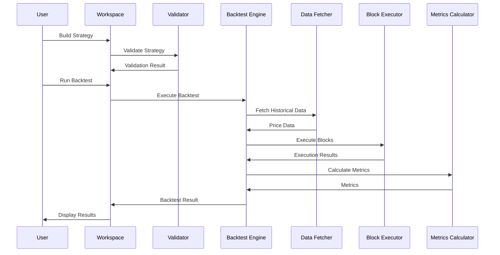
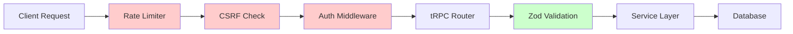
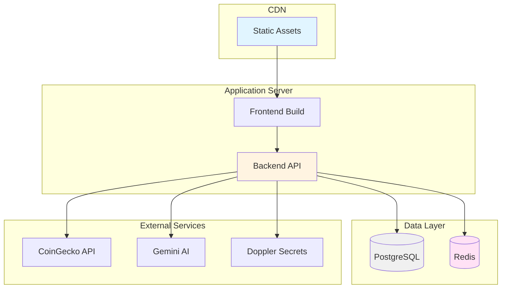

# DeFi Builder Architecture

**Last Updated**: 2025-01-04

## System Overview

DeFi Builder is a full-stack application for building, testing, and executing DeFi strategies. The architecture follows a modern, type-safe approach with clear separation of concerns.

### Key Principles

- **Type Safety**: End-to-end type safety with TypeScript and tRPC
- **Modularity**: Feature-based organization with shared utilities
- **Performance**: Code splitting, lazy loading, and optimized bundles
- **Scalability**: Horizontal scaling support with stateless backend
- **Security**: Server-side API key management, JWT authentication

## High-Level Architecture



## Frontend Architecture

### Component Structure

```
components/
├── ui/              # Reusable UI components (Button, Modal, etc.)
├── modals/          # Modal dialogs (Backtest, Settings, etc.)
├── workspace/       # Workspace-specific components
└── [feature]/       # Feature-specific components
```

### State Management

- **Local State**: React `useState`, `useReducer`
- **Server State**: TanStack Query (via tRPC)
- **Web3 State**: Wagmi hooks
- **Workspace State**: Custom `useWorkspaceState` hook

### Data Flow



## Backend Architecture

### Service Layer

```
backend/src/
├── services/        # Business logic
│   ├── ai.ts       # AI service (Gemini)
│   └── priceFeed.ts # Price data service
├── trpc/           # API routes
│   ├── router.ts   # Main router
│   └── routes/     # Route modules
├── auth/           # Authentication
├── cache/          # Redis caching
└── db/             # Database client
```

### Database Schema



## Data Flow: Strategy Execution



## Security Architecture



### Security Layers

1. **Rate Limiting**: Prevents abuse
2. **CSRF Protection**: Token validation
3. **Authentication**: JWT with httpOnly cookies
4. **Input Validation**: Zod schemas
5. **Output Sanitization**: XSS prevention

## Deployment Architecture



## Technology Stack

### Frontend
- **Framework**: React 19
- **Language**: TypeScript
- **Build Tool**: Vite
- **State Management**: TanStack Query + React Hooks
- **Web3**: Wagmi + Viem
- **UI**: Custom components + TailwindCSS
- **Testing**: Vitest + Playwright

### Backend
- **Runtime**: Node.js 20
- **Framework**: Express
- **API**: tRPC
- **Database**: PostgreSQL (Prisma ORM)
- **Cache**: Redis
- **Authentication**: JWT
- **Validation**: Zod

### Blockchain
- **Libraries**: Wagmi, Viem
- **Chains**: Ethereum, Polygon, Arbitrum, Optimism, Sepolia
- **Contracts**: Solidity (Foundry)

## Key Design Decisions

### 1. Type Safety First
- **tRPC**: End-to-end type safety
- **TypeScript**: Strict mode enabled
- **Zod**: Runtime validation

### 2. Modular Architecture
- **Feature-based**: Features are self-contained
- **Service layer**: Business logic separated
- **Reusable components**: UI components in `components/ui/`

### 3. Performance
- **Code splitting**: Lazy loading for modals
- **Virtual scrolling**: For large lists
- **Caching**: Redis for API responses
- **Debouncing**: For validation and search

### 4. Security
- **API keys**: Server-side only (Doppler)
- **Authentication**: JWT with httpOnly cookies
- **Rate limiting**: Per endpoint
- **Input validation**: Zod schemas

## Future Architecture Considerations

### Scalability
- **Horizontal scaling**: Stateless backend
- **Database**: Read replicas for queries
- **Caching**: Redis cluster
- **CDN**: Static asset delivery

### Monitoring
- **Logging**: Structured logging (Sentry)
- **Metrics**: Performance monitoring
- **Alerting**: Error tracking
- **Audit**: Comprehensive audit logs

### Extensibility
- **Plugin system**: For custom blocks
- **Protocol integrations**: Modular protocol services
- **Multi-chain**: Chain-agnostic design
- **API versioning**: tRPC versioning support

---

For more details, see:
- [API Documentation](./API.md)
- [Backend Setup](../backend/SETUP.md)
- [Deployment Guide](../DEPLOYMENT.md)

